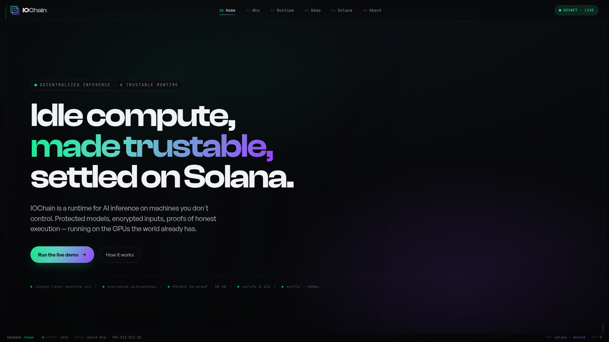

# DESIGN.md: IOChain (reference, not to be copied verbatim)

## Source
- URL: https://www.iochain.dev/
- Capture date: 2026-07-08
- Evidence: Firecrawl branding scrape + full-page screenshot
- Note: this is a **pattern reference**, not a template to clone. Their logo, exact
  copy, and brand identity are theirs — we're borrowing the *shape* of how a
  cryptographically-verified/trustless system presents itself, not the brand.

## Reference Screenshot

## Why this is a useful reference for Strata
IOChain is solving almost the same communication problem we have: "how do you make
a cryptographic proof system feel credible and inspectable to someone in 30 seconds,
not by explaining the math, but by putting the technical facts on screen as data."
Same audience shape too — developers/judges, not consumers.

## Design Tokens (observed, IOChain's own — do not reuse the exact palette verbatim)

### Colors
- Background: near-black (`#07080A`)
- Text primary: light gray (`#858688` / off-white for headings)
- Accent gradient: green → teal → purple, used sparingly (headline emphasis, CTA button,
  live-status dot, logo)
- Borders: very dark gray, barely-there hairlines (`#212429`)
- Color is used as a *signal* (live/devnet status, proof stats) more than as decoration

### Typography
- Heading: bold geometric sans (Clash Display-style), huge scale (h1 ~105px), tight
  tracking, sentence broken across 3 lines for rhythm
- Body: clean sans (General Sans), quiet gray, restrained size
- Monospace (JetBrains Mono) used specifically for **technical/data values** — proof
  sizes, timings, status strings — never for body prose. This is the key move: mono
  font = "this is a real measured number," proportional font = "this is human copy."

### Spacing & Components
- Buttons: fully pill-shaped (`border-radius: 999px`), primary CTA uses the accent
  gradient, secondary is a plain outline — only one visual "loud" element per screen
- Numbered nav items (`00 Home`, `01 Why`, `02 Runtime`...) — turns navigation itself
  into a technical index, not a marketing menu
- A persistent top-right status badge (`● DEVNET · LIVE`) — the "is this real" question
  is answered before you scroll
- A single-line strip of inline stats right under the CTA buttons — small monospace
  dot-separated facts (proof size, verify time, settle time) presented flat, no cards,
  no charts, just numbers a technical reader can immediately evaluate
- A persistent bottom status bar (kernel state, model shape, network, live fps) — like
  a terminal/debugger status line, reinforcing "this is a running system, not a mockup"

## Page Pattern (structure to borrow, not the content)
1. Status badge (top right) — is this live/real, answered immediately
2. Huge headline, one clause per line, one clause gradient-highlighted
3. One paragraph of plain-English explanation
4. Two buttons: one loud primary ("run the actual thing"), one quiet secondary ("explain it")
5. A single strip of inline technical stats in monospace, dot-separated
6. A persistent bottom status bar showing live runtime state

## How this maps onto Strata specifically

**Don't copy the brand — copy the trust-signaling pattern:**
- Our equivalent of "DEVNET · LIVE" → show our actual program address + a live
  "reserved/owed" pool balance pulled from chain, not a static badge
- Our equivalent of the inline proof-stats strip → real numbers from our own system:
  proof size, CPI compute units, settle_leg tx confirmation time, number of legs
  validated — in monospace, dot-separated, exactly like theirs
- Our equivalent of the bottom status bar → live leg-by-leg settlement status during
  a real match ("leg 1: ✅ true · leg 2: pending · leg 3: pending"), which is a direct
  translation of their "kernel idle / model shape / live fps" bar into our domain
- The numbered nav pattern (`00/01/02...`) suits our three-screen plan well: could be
  `00 Build` (product builder) → `01 Watch` (live position view) → `02 Verify`
  (receipt/proof page)

**What NOT to copy:** the logo, the exact color values, "IOChain" branding, or their
specific copy. Strata needs its own visual identity — this doc is about the
*technique* (mono-for-data, numbered nav, persistent live-status bar, one accent
gradient used sparingly), applied to our own colors and words.

## Rerun Inputs
workflow: firecrawl-website-design-clone
source_url: https://www.iochain.dev/
target_stack: (TBD — not yet decided for Strata's frontend)
output: design/DESIGN.md
