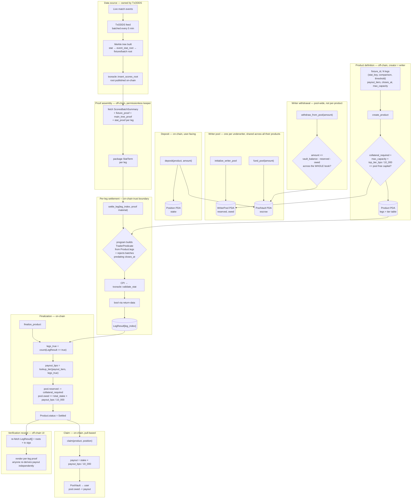

# Strata — Settlement Architecture

Structured parametric payoffs settled on-chain via TxLINE Merkle proofs. No AMM, no pricing curve, no oracle trust — settlement is a permissionless proof-verification pipeline over discrete proven outcomes. Real upside is funded by a writer's collateral, pooled and shared across every product that writer creates, with a single provable solvency invariant instead of N separate dedicated vaults.



## The solvency invariant

Every instruction that touches `reserved` or `owed` preserves one inequality, never re-derives it from scratch per product:

```
pool_vault_balance >= reserved (open products' worst cases) + owed (settled, confirmed, unclaimed payouts)
```

- `fund_pool` only grows the left side.
- `create_product` checks free capital exists, then grows `reserved`.
- `finalize_product` moves an amount from `reserved` to `owed` — a pure transfer between the two counters, net effect on the invariant is zero.
- `claim` shrinks `vault_balance` and `owed` by the same amount — invariant unchanged.
- `withdraw_from_pool` only allows `vault_balance - reserved - owed` — provably safe across the writer's **entire book of products at once**, not a per-product calculation.

## Component cheat sheet

| Component | Why |
|---|---|
| `WriterPool` PDA | One per writer. Tracks `reserved` + `owed` as two running totals — no list of products needed, scales to any number of them with O(1) state. |
| `PoolVault` PDA | Shared escrow for one writer's entire book — collateral and buyer premiums both live here, not in per-product vaults. |
| `Product` PDA | Immutable leg definitions + payout tier table + a reference to the writer pool backing it. |
| `Position` PDA | Per-user stake, one claim flag. Pull-based payout, not push. |
| `settle_leg` (permissionless) | Anyone can call it — trust comes from the CPI-verified Merkle proof, not the caller's identity. Also rejects any batch that predates `closes_at`, blocking latency-sniping off TxLINE's live (unprovable) stream. |
| `txoracle::validate_stat` CPI | Read-only proof verifier against TxLINE's on-chain roots. We never read live state — TxLINE doesn't expose any. |
| Payout tier table | Deterministic, monotonic, validated at `create_product` time on-chain — no off-chain pricing, no AMM curve. Top tier sets the worst-case collateral requirement. |
| `withdraw_from_pool` | The actual cross-product feature: one call, provably safe across every open and settled-unclaimed product the writer has, not N separate per-product withdrawals. |
| Verification receipt UI | Re-derives the payout from on-chain data alone — zero backend trust required to audit a settlement. |

## Account map

| Account | Seeds | Holds |
|---|---|---|
| `WriterPool` | `["writer_pool", writer]` | writer, reserved, owed |
| `PoolVault` | `["pool_vault", writer]` | escrow lamports — collateral + buyer premiums, shared |
| `Product` | `["product", fixture_id, nonce]` | fixture_id, legs[], payout_tiers[], status, closes_at, leg_results, writer, writer_pool, max_capacity, collateral_locked |
| `Position` | `["pos", product, user]` | user, stake, claimed |

## Core instructions

1. `initialize_writer_pool` / `fund_pool` — one-time setup + capital top-ups
2. `create_product` — define legs + tier table, reserve worst-case collateral from the pool
3. `deposit` — buyer premium into the pool vault
4. `settle_leg` — permissionless, one CPI per leg into `validate_stat`, rejects stale batches
5. `finalize_product` — tally legs_true → payout_bps, move obligation reserved → owed
6. `claim` — pull-based payout, releases the matching `owed` amount
7. `withdraw_from_pool` — writer reclaims whatever isn't backing any open or owed obligation

## Why this, not an AMM/pricing-curve design

TxLINE's `validate_stat` is a read-only Merkle-proof verifier against roots published every 5 minutes — not a continuous live price feed. A bonding-curve/dynamic-pricing design assumes state TxLINE doesn't expose. Strata instead treats TxLINE purely as a settlement/verification rail and expresses the product logic as a deterministic tiered payout table, with real upside funded by underwriter collateral — financial engineering over discrete proven outcomes, not pricing mechanics.
