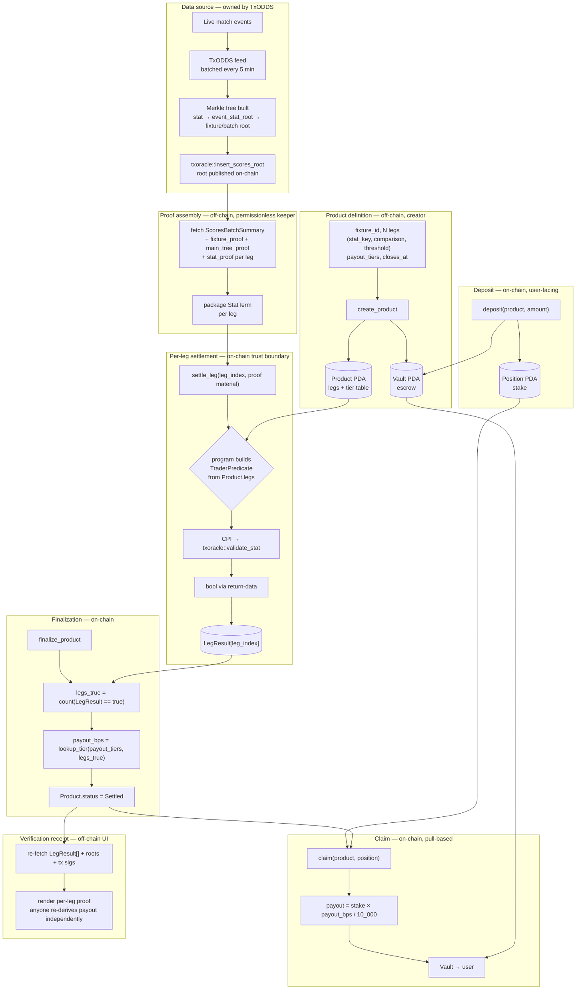

# Strata — Settlement Architecture

Structured parametric payoffs settled on-chain via TxLINE Merkle proofs. No AMM, no pricing curve, no oracle trust — settlement is a permissionless proof-verification pipeline over discrete proven outcomes.

## Component cheat sheet

| Component | Why |
|---|---|
| `Product` PDA | Immutable leg definitions + payout tier table. Source of truth for what gets settled. |
| `Vault` PDA | Escrow only — holds stakes, never holds logic. |
| `Position` PDA | Per-user stake, one claim flag. Pull-based payout, not push. |
| `settle_leg` (permissionless) | Anyone can call it — trust comes from the CPI-verified Merkle proof, not the caller's identity. |
| `txoracle::validate_stat` CPI | Read-only proof verifier against TxLINE's on-chain roots. We never read live state — TxLINE doesn't expose any. |
| Payout tier table | Deterministic, monotonic, validated at `create_product` time on-chain — no off-chain pricing, no AMM curve. |
| Settlement deadline | Legs unproven by deadline default to `false`, so the system always resolves to a payout. |
| Verification receipt UI | Re-derives the payout from on-chain data alone — zero backend trust required to audit a settlement. |

## Account map

| Account | Seeds | Holds |
|---|---|---|
| `Product` | `["product", fixture_id, nonce]` | fixture_id, legs[] (stat_key, comparison, threshold, op), payout_tiers[], status, closes_at, leg_results bitmap |
| `Vault` | `["vault", product]` | escrow lamports/tokens only |
| `Position` | `["pos", product, user]` | user, stake, claimed |

## Core instructions

1. `create_product` — define legs + tier table, init Vault
2. `deposit` — stake into a position
3. `settle_leg` — permissionless, one CPI per leg into `validate_stat`
4. `finalize_product` — tally legs_true → payout_bps from tier table
5. `claim` — pull-based payout

## Why this, not an AMM/pricing-curve design

TxLINE's `validate_stat` is a read-only Merkle-proof verifier against roots published every 5 minutes — not a continuous live price feed. A bonding-curve/dynamic-pricing design assumes state TxLINE doesn't expose. Strata instead treats TxLINE purely as a settlement/verification rail and expresses the product logic as a deterministic tiered payout table — financial engineering over discrete proven outcomes, not pricing mechanics.
